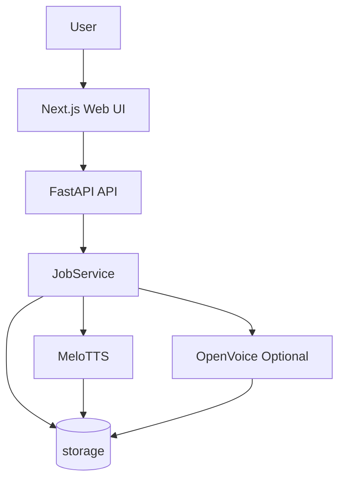

# TTS Generator

<p align="center">
  
  
  
  
  
  
</p>

<p align="center">
  텍스트 입력과 Markdown 업로드를 하나의 파이프라인으로 처리하는 웹 TTS 워크스페이스
</p>

**TTS Generator**는 `FastAPI` 백엔드와 `Next.js` 프론트엔드를 결합해  
텍스트 직접 입력, Markdown 업로드, 샘플 보이스 확장, Job 상태 추적, 결과 다운로드를 한 흐름으로 묶은 웹 TTS 서비스입니다.

- 텍스트와 Markdown을 공통 `TTSDocument -> TTSSegment -> Job` 구조로 정규화
- `MeloTTS` 기반 한국어 기본 보이스 합성
- 샘플 보이스 선택 시 `OpenVoice` 기반 tone color conversion 확장
- segment 단위 WAV 생성 후 병합하고, 필요할 때만 `ffmpeg`로 MP3 변환
- `storage/` 디렉터리 기준 로컬 Job 메타데이터와 출력 파일 관리

## Structure

> 현재는 저장소 내부 구성과 처리 흐름만 Mermaid 다이어그램으로 표현했습니다.



1. 사용자는 `web/` 화면에서 텍스트를 입력하거나 Markdown 파일을 업로드합니다.
2. `FastAPI`는 입력을 `TTSDocument`와 `TTSSegment`로 정규화하고 `job_id`를 발급합니다.
3. `JobService`는 백그라운드 작업으로 segment별 WAV를 생성합니다.
4. 생성된 segment는 병합되고, 요청 포맷이 `mp3`면 추가 변환을 수행합니다.
5. Job 메타데이터는 `storage/jobs`, 결과 파일은 `storage/outputs`에 저장되며, 프론트는 polling으로 상태를 조회합니다.

## 작업 처리 방식

오래 걸리는 음성 생성 요청은 API 응답을 막지 않고, 현재 프로세스 내부 백그라운드 작업으로 처리합니다.

1. `POST /api/v1/jobs/text` 또는 `POST /api/v1/jobs/markdown` 요청이 들어오면 `queued` 상태의 Job이 생성됩니다.
2. 서버는 `asyncio.create_task`로 작업을 등록하고, 실제 합성은 스레드로 넘겨 처리합니다.
3. 실행 중에는 `status`는 `queued`, `processing`, `completed`, `failed`로 관리되고, `stage`는 `generating`, `merging`, `converting` 중심으로 갱신됩니다.
4. 프론트엔드는 `GET /api/v1/jobs/{job_id}`를 주기적으로 호출해 진행률과 결과 파일 상태를 갱신합니다.
5. 다운로드 응답이 끝나면 백그라운드 정리 작업으로 해당 Job의 출력 디렉터리와 레거시 업로드 파일이 제거됩니다.

현재 구조의 특성:

- 별도 메시지 큐나 외부 worker 없이 API 프로세스 내부에서 작업을 처리합니다.
- Markdown 업로드 원문은 별도 영구 보관하지 않고, 파싱 후 메모리 기준으로만 사용합니다.
- Job 상태와 산출물 경로는 로컬 파일 시스템 기준으로 관리합니다.

## 기술스택

| 영역 | 스택 |
| --- | --- |
| Frontend | Next.js 15, React 19, TypeScript, Tailwind CSS, shadcn/ui 스타일 컴포넌트 |
| Backend | FastAPI, Uvicorn, `python-multipart` |
| TTS | MeloTTS, `ffmpeg` |
| Voice Clone Optional | OpenVoice ToneColorConverter |
| Storage | 로컬 파일 시스템 `storage/` |
| Test | `pytest`, `unittest`, `compileall` |

## TTS / Voice 구성

- 시스템 기본 보이스는 현재 `KR` 한국어 MeloTTS 보이스를 중심으로 동작합니다.
- 설정 카탈로그에는 `KR_FEMALE`, `KR_MALE` 별칭이 있지만 UI에는 중복 런타임 보이스를 합쳐 보여줍니다.
- `storage/voice_samples`에 넣은 `.wav`, `.mp3`, `.m4a`, `.flac`, `.ogg` 파일은 `sample:<파일명>` 형식의 샘플 보이스로 자동 노출됩니다.
- 샘플 보이스를 선택하면 `MeloTTS`로 기본 음성을 먼저 만들고, 이후 `OpenVoice`가 tone color conversion을 적용합니다.
- `OpenVoice` 패키지나 체크포인트가 준비되지 않은 상태에서 샘플 보이스를 선택하면 요청은 오류로 종료됩니다.
- `GET /api/v1/openvoice/status`로 설치 여부와 체크포인트 준비 상태를 확인할 수 있습니다.

## Repository Layout

```text
tts-generator/
├── app/
│   ├── api/routes/              # FastAPI 라우트
│   ├── core/                    # 설정, 공통 에러
│   ├── models/                  # 도메인 모델, Job 모델
│   ├── parsers/                 # Markdown tts 블록 파서
│   ├── providers/               # MeloTTS, OpenVoice provider
│   ├── schemas/                 # 요청/응답 스키마
│   └── services/                # 문서 생성, Job 처리, 스토리지, 오디오 처리
├── storage/
│   ├── uploads/                 # 업로드 관련 임시 경로
│   ├── jobs/                    # Job 메타데이터 JSON
│   ├── outputs/                 # 생성 결과물
│   ├── voice_samples/           # 개발자 샘플 보이스
│   └── models/                  # OpenVoice 체크포인트
├── tests/                       # 파서, 서비스, provider 테스트
└── web/
    ├── app/                     # Next.js App Router 엔트리
    ├── components/              # TTS UI, 공통 UI 컴포넌트
    └── lib/                     # API client, 유틸리티
```

## API Summary

| Method | Path | 설명 |
| --- | --- | --- |
| `GET` | `/health` | 서버 헬스체크 |
| `GET` | `/api/v1/voices` | 시스템 보이스와 샘플 보이스 목록 조회 |
| `GET` | `/api/v1/openvoice/status` | OpenVoice 설치 및 체크포인트 준비 상태 조회 |
| `POST` | `/api/v1/jobs/text` | 텍스트 직접 입력 기준 Job 생성 |
| `POST` | `/api/v1/jobs/markdown` | `.md` 파일 업로드 기준 Job 생성 |
| `GET` | `/api/v1/jobs/{job_id}` | Job 상태, 진행률, 결과 파일 정보 조회 |
| `GET` | `/api/v1/jobs/{job_id}/download` | 완료된 결과 파일 다운로드 |

텍스트 입력 예시:

```json
{
  "text": "안녕하세요. 오늘 안내를 시작하겠습니다.",
  "output_format": "wav",
  "speaker": "진행자",
  "voice": "KR",
  "speed": 1.0,
  "style": "conversational",
  "mode": "conversational",
  "normalize_spoken_text": true,
  "sentence_split": true
}
```

## Markdown 입력 규칙

상단 `tts` 코드 블록으로 기본 옵션과 화자별 오버라이드를 지정할 수 있습니다.

```tts
engine: melo
format: wav
voice.default: KR
speed.default: 1.0
mode.default: conversational
normalize_spoken_text: true
sentence_split: true
pause_ms.line: 300
pause_ms.paragraph: 700
voice.진행자: KR
voice.상담원: sample:상담원
speed.상담원: 1.1
```

본문 예시:

```text
진행자: 안녕하세요. 오늘 서비스 이용 방법을 안내해드릴게요.
상담원: 먼저 회원가입부터 진행해 주세요.
```

동작 규칙:

- 현재 `engine`은 `melo`만 지원합니다.
- `format`은 `wav` 또는 `mp3`를 지원합니다.
- 본문은 기본적으로 `speaker: text` 형식으로 파싱합니다.
- 빈 줄은 문단 경계로 처리하며, 줄 간 pause와 문단 간 pause를 다르게 적용합니다.
- 같은 문단에서 같은 화자가 이어지면 하나의 블록으로 병합한 뒤 segment로 분해합니다.
- `sample:<이름>` 형식은 `storage/voice_samples/<이름>.*` 샘플 보이스와 연결됩니다.

## 실행 방법

### 1. 백엔드 환경 준비

`MeloTTS` 실합성은 현재 저장소 기준 `Python 3.11+` 환경을 전제로 합니다.

```bash
python3.11 -m venv .venv
source .venv/bin/activate
pip install -e .
```

### 2. MeloTTS 설치

실제 음성 생성을 하려면 optional dependency를 추가로 설치해야 합니다.

```bash
pip install -e .[melo]
```

참고:

- `melo` extra에는 `python-mecab-ko`, `python-mecab-ko-dic`, `setuptools<81` 제약이 포함되어 있습니다.
- MP3 변환과 WAV 정규화를 위해 시스템에 `ffmpeg`가 설치되어 있어야 합니다.

### 3. 샘플 보이스 등록

샘플 보이스 파일을 아래 디렉터리에 넣으면 보이스 목록에 자동으로 노출됩니다.

```text
storage/voice_samples/
```

예시:

```text
storage/voice_samples/민지.wav
storage/voice_samples/상담원.mp3
```

### 4. OpenVoice 준비

샘플 보이스 tone color conversion을 사용하려면 `OpenVoice`와 체크포인트가 추가로 필요합니다.

설치 예시:

```bash
pip install --no-deps git+https://github.com/myshell-ai/OpenVoice.git
```
